<br /><br /><br /><br /><br /><br /><br /><br />
<br /><br /><br /><br /><br /><br /><br /><br />


## Introduction to DevOps **(SEZG514)**
### Assignment - 1

<br /><br /><br /><br />

**Submitted by:** Soumya Prakash Datta 
<br/>
**Roll:** 2022mt93539 
<br/>
**Email:** 2022mt93539@wilp.bits-pilani.ac.in
<br/>

<div style="page-break-after: always;"></div>

# Problem statement:

ABC Organization would like to opt for the distributed version control system to upgrade their environment, where Git has been selected as the solution. You been assigned as a consultant to educate the migration process to move their Source Code from Centralized to Distributed systems. As a phase one, you would like to go ahead with a workshop to demonstrate below operation to make the ABC team comfortable.

1. [Create a Repository](#create-a-repository)
2. [Add two directories and some raw code files to the repository](#add-two-directories-and-some-raw-code-files-to-the-repository)
3. [Move code from one directory to another directory](#move-code-from-one-directory-to-another-directory)
4. [Update one source code file and display the difference](#update-one-source-code-file-and-display-the-difference)
5. [Create a Branch](#create-a-branch)
6. [Add some raw code to the branch](#add-some-code-to-the-branch)
7. [Merge the Branch with Main line](#merge-the-branch-with-main-line)

And at the end provide the Summary of advantages of moving from Centralized Source Code to Distributed Version Control.

<div style="page-break-after: always;"></div>

# Setup:

We need to setup `git` locally and for that we can follow official guide from https://git-scm.com/book/en/v2/Getting-Started-Installing-Git 

After installing `git` we can set our **username** and **email** detail globally or this can be setup later on a repo-by-repo basis.

Global setup can be done as follows -

```sh
git config --global user.name "username"
git config --global user.email "email@domain"
```

To create `git` repo remotely there are many choices, for this project we are going to use [github](https://github.com/)

<div style="page-break-after: always;"></div>

# Create a repository:

Repository can be created using `git init` command. 

Let's create a directory
```sh
mkdir test_repo
cd test_repo
```

Initializing git repo
```sh
git init
```

At this point we have initialized an empty git repository.

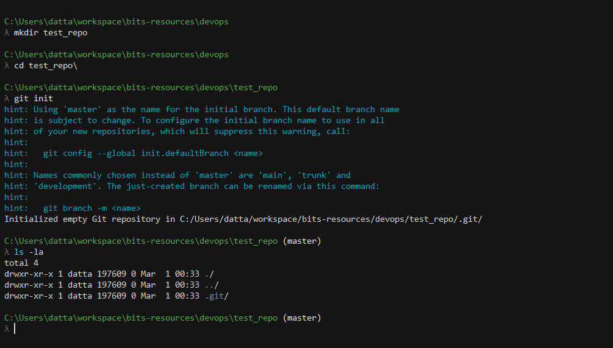


Now let's setup remote repo in github and link our local repo with it. We can just go to [github](https://github.com) and click on the click on the **new** button and fill in the details to create a new repo, sample details are added below

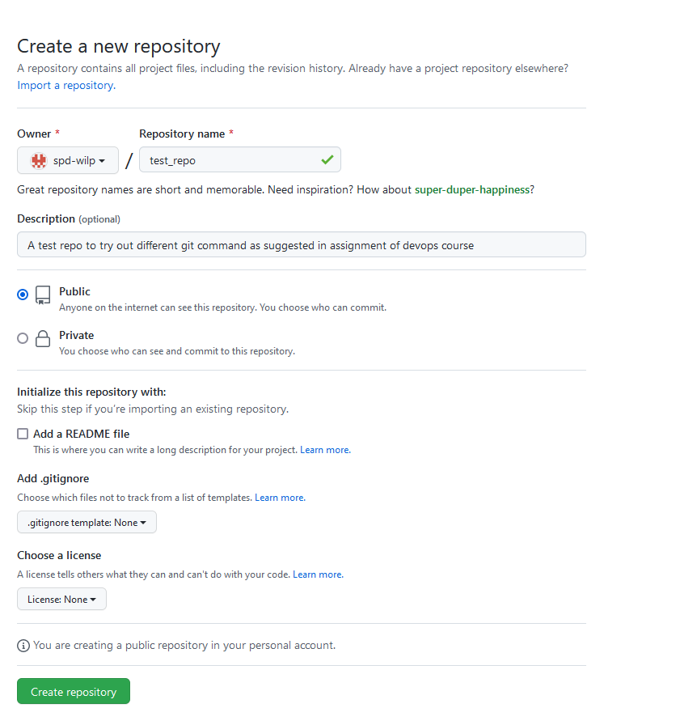

Now we need to link our local repo to this remote one, for that we can use `git remote add <name> <link>` command, afterwards we can use `git remote -v` to validate. Let's add our newly created github repo with the name `origin`

```sh
git remote add origin https://github.com/spd-wilp/test_repo.git
git remote -v
```
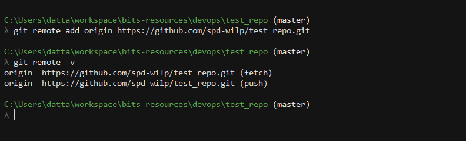

Just to keep things simple, will skip github specific details till the very end of this project, but in general, github provides workflows around managine branches, raising pull-request, code review and many more things.

<div style="page-break-after: always;"></div>

# Add two directories and some raw code files to the repository

Let's create two directories, `dir1` and `dir2` and create some files inside them
```sh
mkdir dir1 dir2
touch dir1/f1 dir1/f2 dir2/f3 dir2/f4 dir2/f5
```
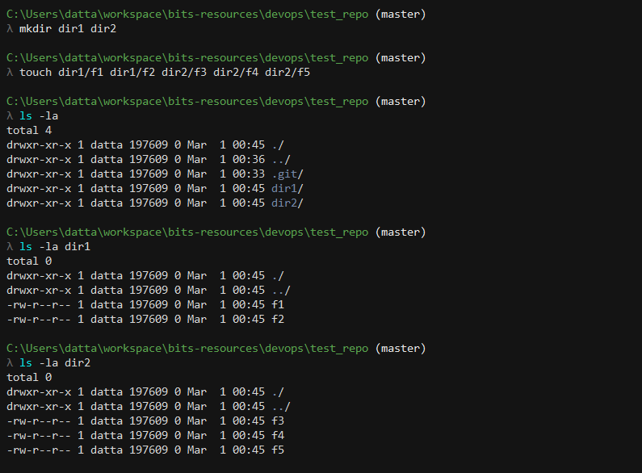

Now using `git status` we can see that git is not yet tracking those newly created directories/files
```sh
git status
```

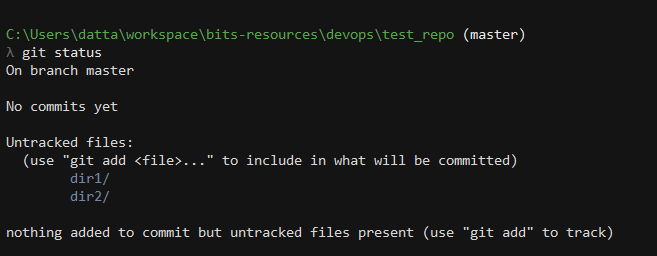

To add those files to repository, we can use `git add` and `git commit`
```sh
git add --all
git commit -m "added initial files"
```
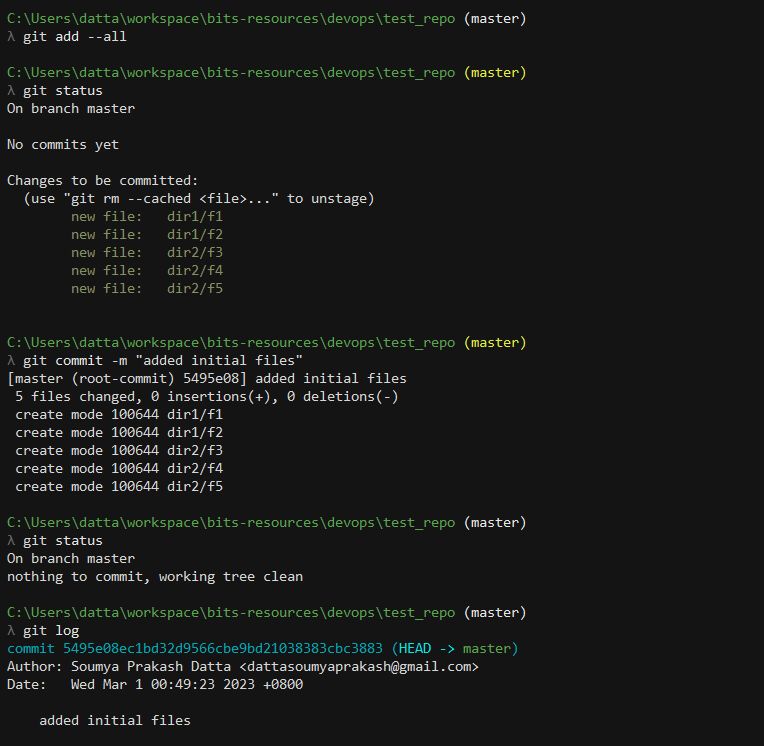

At this point all files are added to our local git repo

<div style="page-break-after: always;"></div>

# Move code from one directory to another directory

We can move file from one directory to other directory in git repository using `git mv`

For example lets move `f2` file from `dir1` to `dir2` and then commit this change in git
```sh
git mv dir1/f2 dir2
git status
git commit -m "moved file"
```

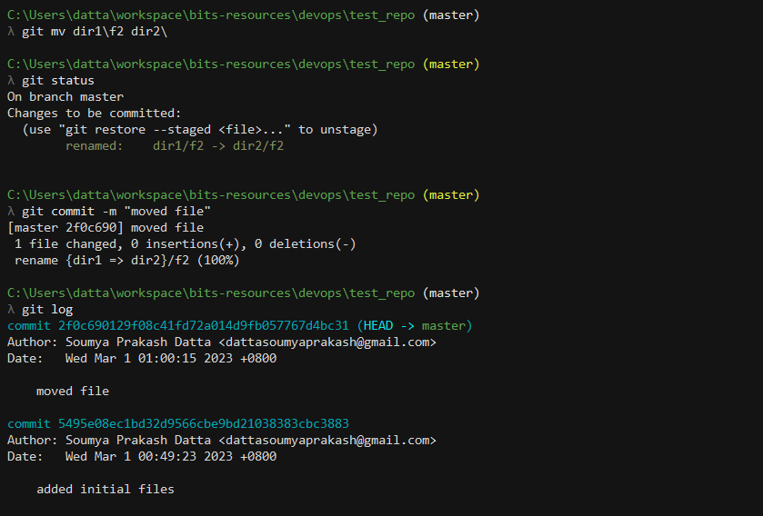

<div style="page-break-after: always;"></div>

#	Update one source code file and display the difference

Right now the files we have created are empty, lets add some content into one of those files. We can check difference using `git diff` command

```sh
echo 'hello world' > dir1/f1
git status
git diff
```

Lets now commit this change in repo
```sh
git add --all
git commit -m "added content in a file"
```

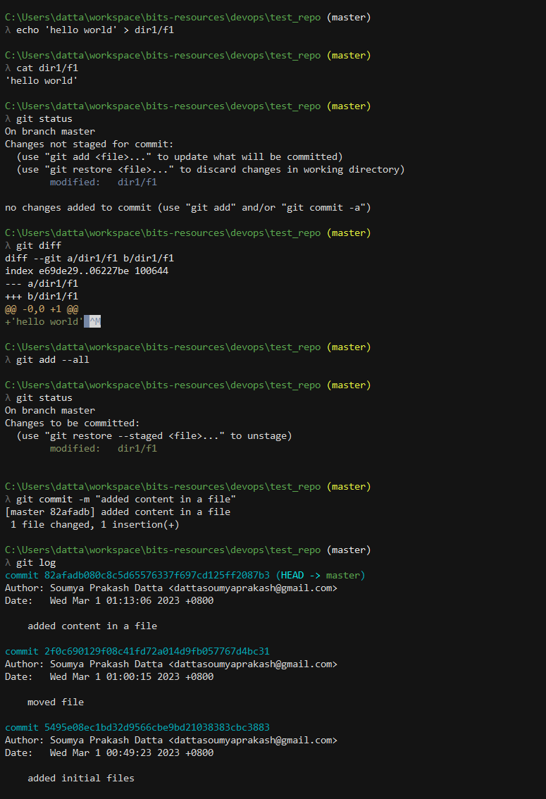

<div style="page-break-after: always;"></div>

# Create a branch

So far we have been working from the `master` branch. Lets create a `dev` branch using `git branch` command. After that we can using `git checkout` command to switch to the newly created branch.

```sh
git branch dev
git checkout dev
```

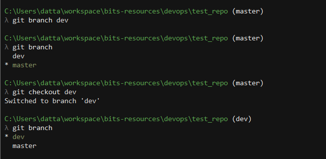

<div style="page-break-after: always;"></div>

#	Add some code to the branch

To change content of a branch, we can first use `git checkout` to switch to the branch, then we can make changes and then perform `git add` and `git commit` to save our changes to the branch

```sh
git checkout dev
touch dir1/f6
echo "some content" > dir1/f6
git add --all
git commit -m "added a new file"
```

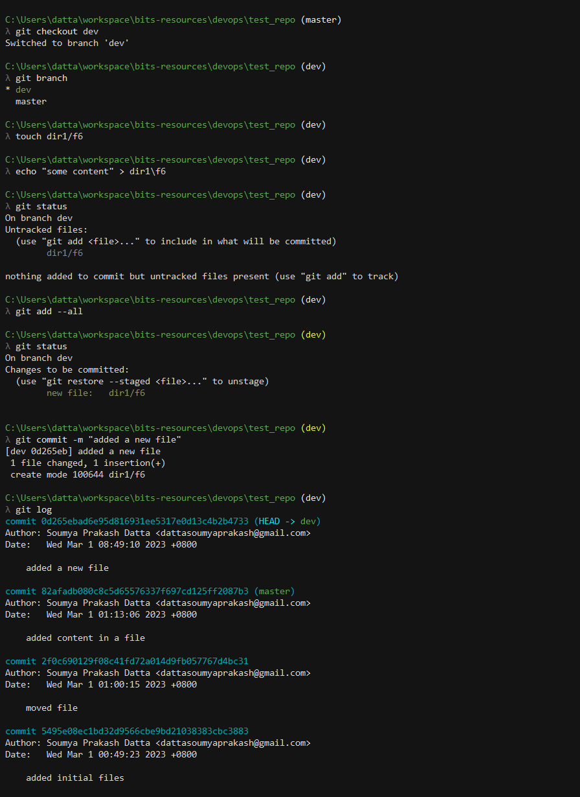

<div style="page-break-after: always;"></div>

# 	Merge the Branch with Main line

Now we have added a file in `dev` branch in the privious step. To merge that update in `master` branch, we can use `git merge`.

```sh
git checkout master
git merge dev
```

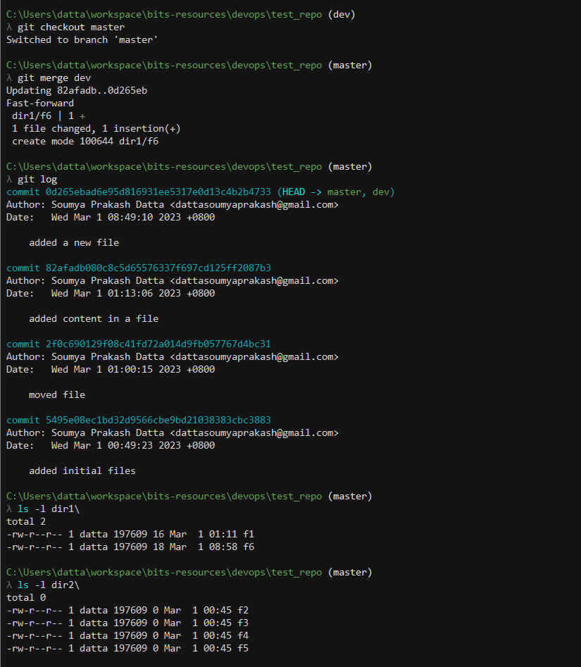

Now let's push all our changes to `github`. For this we can use `git push <remote_name> <branch_name>` command, for our case in the beginning we used `origin` as remote_name, and for now we can push all branches to remote, using `--all` option.

One thing to note here, as we are using `https` in this example, we won't be able to use password as authentication mechanism for github, we have to use `access_token`, it can be provided from github web interface and guide for the same is accessible at [setup github access token](https://docs.github.com/en/authentication/keeping-your-account-and-data-secure/creating-a-personal-access-token)

Another option is to use `ssh` to connect to github and in that case `ssh keys` will be used for authentication, setup guide for the same can be found at [setup ssh key](https://docs.github.com/en/authentication/connecting-to-github-with-ssh/adding-a-new-ssh-key-to-your-github-account)

```sh
# in case we have a different user in git global config, this will make sure github to provide authentication prompt and not use the global user by default
git config --local credential.helper ""

git push --all origin
```

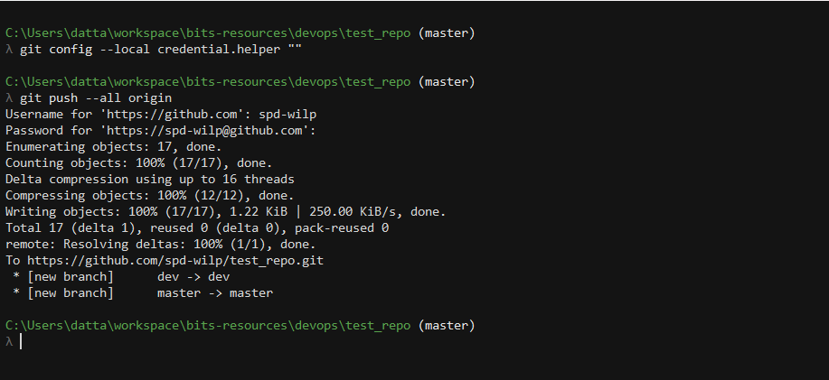

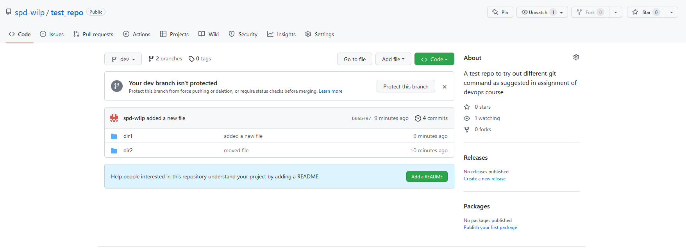

<div style="page-break-after: always;"></div>

# Advantages of Distributed Version Control Systems (DVCS) to Centralized Version Control Systems (CVCS)

1. **Offline work:** One of the most significant advantages of DVCS is the ability to work offline. Developers can work on their local copy of the repository, make changes, and commit them locally without requiring any connection to the central server.

2. **Better collaboration:** In a DVCS, developers can collaborate better and more easily since they can clone the repository and work on their own copy of code, committing and merging changes when they're ready. This can be particularly useful for remote teams who may have limited or unreliable network connectivity.

3. **No single point of failure:** DVCS systems don't have a single point of failure like CVCS systems. If the central server goes down, developers can continue working on their local copies of the repository and then sync changes when the server comes back online. Also in case the central server loses its data, it can be restored easily from one of the local developer copies.

4. **Branching and merging:** DVCS systems are great at branching and merging, allowing developers to create and merge branches easily. This allows for more experimentation and faster iteration in development.

<div style="page-break-after: always;"></div>

# Resources

Github repo: [https://github.com/spd-wilp/test_repo](https://github.com/spd-wilp/test_repo)

Assignment source has been added inside the repo as well.